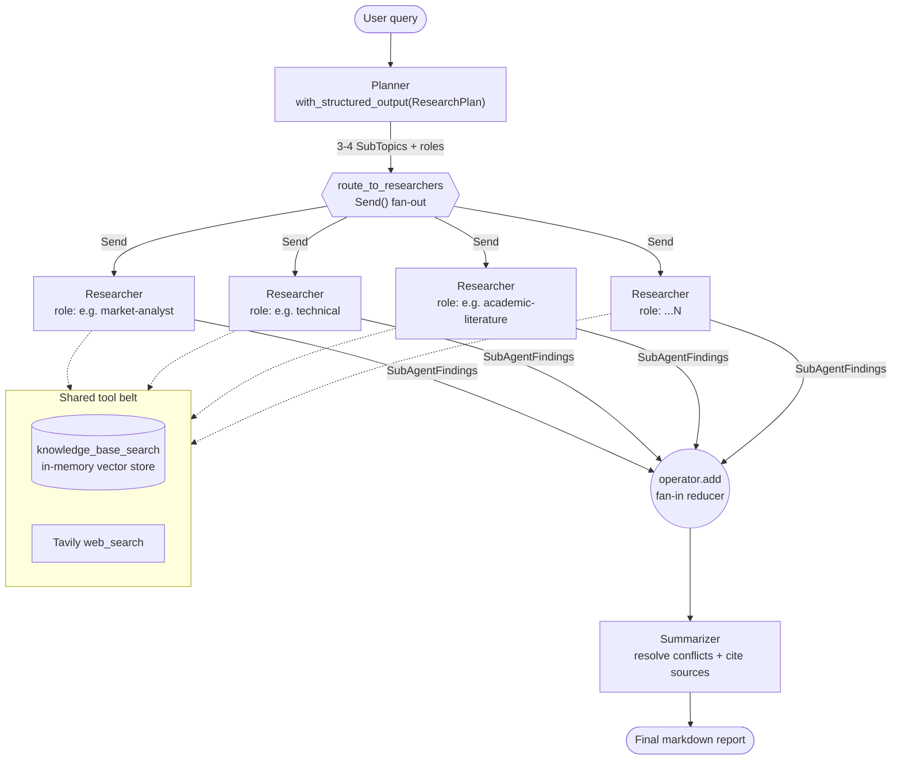
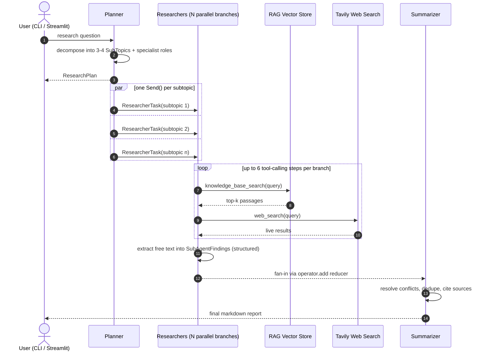
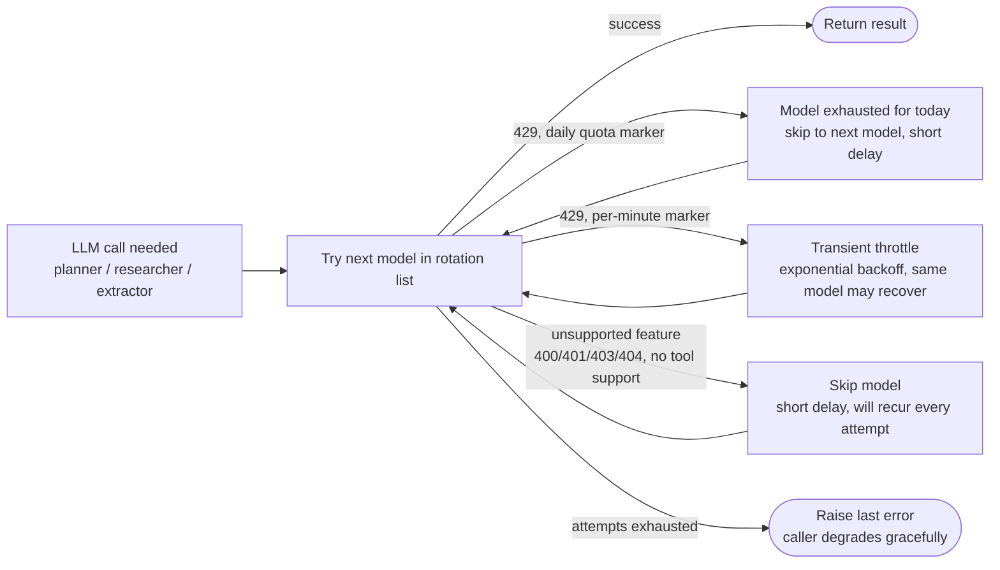

# Multi-Agent Research System

**A stateful, parallel multi-agent research pipeline built on LangGraph.** Give it a question, and a `planner` agent breaks it into independent sub-topics, a swarm of specialist `researcher` agents investigates each one in parallel (RAG knowledge base + live web search), and a `summarizer` agent reconciles everything into one cited markdown report.


## Table of Contents

- [Overview](#overview)
- [Key Features](#key-features)
- [Architecture](#architecture)
- [How a Request Flows](#how-a-request-flows)
- [Surviving Free-Tier Rate Limits](#surviving-free-tier-rate-limits)
- [Tech Stack](#tech-stack)
- [Project Structure](#project-structure)
- [Getting Started](#getting-started)
- [Configuration](#configuration)
- [Using Your Own Knowledge Base](#using-your-own-knowledge-base)
- [Extending the System](#extending-the-system)
- [License](#license)

## Overview

Most "research agent" demos are a single LLM with a search tool bolted on. This project is different: it's a genuine **multi-agent graph** where a planner dynamically decides *how many* specialists a question needs, spins them all up **in parallel**, lets each one dig through both a private knowledge base and the live web, and then hands everything to a synthesizer that resolves disagreements and cites its sources.

It ships with two front ends — a CLI for quick queries and a Streamlit "Research Studio" that streams progress live — and a resilience layer that rotates across multiple LLM providers (Google Gemini, Groq, HuggingFace) so the whole pipeline keeps running even when a free-tier quota gets exhausted mid-run.

## Key Features

- **Dynamic parallel fan-out** — the planner decides 3–4 sub-topics per question, and LangGraph's `Send()` API spins up exactly that many researcher branches concurrently, no hardcoded agent count.
- **Dual-source research** — every researcher has access to an internal RAG knowledge base *and* live Tavily web search, and is instructed to prefer the trusted internal source first.
- **Structured everything** — the plan, each researcher's findings, and the fan-in are all typed Pydantic schemas (`ResearchPlan`, `SubAgentFindings`), not free-floating text.
- **Quota-aware model rotation** — LLM calls rotate across a configurable list of providers/models and distinguish per-minute throttling from per-day quota exhaustion, so one exhausted free-tier key doesn't stall the run.
- **Graceful degradation** — if one researcher branch throws, it returns a "failed" findings record instead of crashing the graph; the summarizer still produces a report from whatever succeeded.
- **Two front ends** — a scriptable CLI (`main.py`) and a Streamlit UI (`app.py`) with live per-node progress, an editable knowledge-base picker, and runtime sliders for sub-agent count / retrieval depth.
- **Checkpointed graph** — built on LangGraph's `StateGraph` with `InMemorySaver`, ready to swap in a durable checkpointer (e.g. Postgres) for resumable, production-grade runs.

## Architecture



Every researcher branch receives only its own `ResearcherTask` (query + assigned sub-topic) rather than the full graph state — LangGraph schedules them all in the same superstep. Because `research_results` is typed `Annotated[List[SubAgentFindings], operator.add]`, the branch outputs merge into a single list automatically the moment every branch finishes, with no manual join logic.

## How a Request Flows



Walking through the source: `graph.py::route_to_researchers` is the conditional edge that turns the plan into `Send` objects; `agents/researcher.py` runs a manual tool-calling loop (not LangChain's `create_agent`, since Groq doesn't support the `tool_choice="any"` it forces) and then runs a *second*, tool-free LLM call to normalize the free-text answer into the `SubAgentFindings` schema; `agents/summarizer.py` is the only node that sees every branch's output at once.

## Surviving Free-Tier Rate Limits

Running on free-tier API keys (Google's ~5 req/min, ~20 req/day per model) means 429s are the normal case, not the exception — especially with several researcher branches hitting the same model at once. `agents/_retry.py` handles this with `call_with_model_rotation`, which every LLM call in the graph goes through:



Each of `planner_models`, `researcher_models`, and `extractor_models` is an ordered list (default: Gemini variants, then Groq's OSS models). Parallel researcher branches also stagger their starting index (`hash(subtopic.id) % len(models)`) so they don't all hammer model #1 at the exact same moment.

## Tech Stack

| Layer | Technology |
|---|---|
| Orchestration | [LangGraph](https://github.com/langchain-ai/langgraph) — `StateGraph`, dynamic `Send()` fan-out, `InMemorySaver` checkpointing |
| Agent / tool calling | [LangChain](https://github.com/langchain-ai/langchain) — structured output, `bind_tools`, retriever tools |
| LLM providers | Google Gemini (`google_genai`), Groq (OpenAI OSS models), HuggingFace Inference API (fallback) |
| Retrieval | `InMemoryVectorStore` + Gemini embeddings (swappable for Chroma / FAISS / PGVector / Pinecone) |
| Live web search | [Tavily](https://tavily.com/) |
| Validation | Pydantic v2 |
| Frontend | Streamlit ("Multi-Agent Research Studio") + a plain CLI |
| Language | Python ≥ 3.11 |

## Project Structure

```
research_agent/
├── app.py                       # Streamlit UI — "Multi-Agent Research Studio"
├── pyproject.toml               # Package metadata + dependencies (src layout)
├── .env.example                 # Every env var, documented
├── kb/                          # Sample knowledge base (RAG source)
│   ├── MRI_Brain_Tumor_Detection.md
│   └── ...source_paper.pdf      # see note in "Using Your Own Knowledge Base"
└── src/research_agent/
    ├── main.py                  # CLI entrypoint
    ├── graph.py                 # StateGraph wiring + Send() fan-out router
    ├── state.py                 # ResearchState, ResearcherTask, Pydantic schemas
    ├── config.py                # Settings (env-driven) + build_chat_model()
    ├── agents/
    │   ├── planner.py           # query -> ResearchPlan (structured output)
    │   ├── researcher.py        # tool-calling loop -> SubAgentFindings
    │   ├── summarizer.py        # findings -> final markdown report
    │   └── _retry.py            # call_with_model_rotation() — quota-aware retry
    ├── rag/
    │   ├── ingest.py            # loads kb/ -> InMemoryVectorStore
    │   └── retriever_tool.py    # wraps the store as a LangChain tool
    └── tools/
        └── web_search.py        # Tavily live web search tool
```

## Getting Started

### Prerequisites

- Python 3.11+
- At least one LLM provider key (**Google Gemini** and/or **Groq**) and a **Tavily** key for web search. HuggingFace is an optional extra fallback.

### Installation

```bash
git clone https://github.com/AbdulSamad9011/Multi-Agent-Research-System.git
cd Multi-Agent-Research-System
pip install -e .
cp .env.example .env      # then fill in your API keys
```

### Run it

CLI — one-shot query, prints the final report to stdout:

```bash
python -m research_agent.main "What is the state of solid-state EV batteries in 2026?"
```

Streamlit — interactive UI with live per-node progress, a knowledge-base picker, and runtime sliders:

```bash
streamlit run app.py
```

## Configuration

All settings are environment-overridable (`src/research_agent/config.py`, loaded via `.env`).

**API keys**

| Variable | Required for |
|---|---|
| `GOOGLE_API_KEY` | Gemini models (planner/researcher default, embeddings) |
| `GROQ_API_KEY` | Groq models (summarizer default, extractor, fallback) |
| `TAVILY_API_KEY` | Live web search |
| `HUGGINGFACEHUB_API_TOKEN` | Optional `huggingface:*` fallback models |

**Model routing** — each accepts a comma-separated `"provider:model"` list; the first entry is also exposed as a single-model override.

| Variable | Default | Purpose |
|---|---|---|
| `PLANNER_MODELS` | Gemini 3.x variants → Groq OSS | Rotation for the planner node |
| `RESEARCHER_MODELS` | Gemini 3.x variants → Groq OSS | Rotation for tool-calling researchers |
| `EXTRACTOR_MODELS` | Groq OSS 120b, 20b | Converts researcher free text → structured `SubAgentFindings` |
| `SUMMARIZER_MODEL` | `groq:openai/gpt-oss-120b` | Final report synthesis (single model, tool-free) |
| `EMBEDDING_MODEL` | `google_genai:gemini-embedding-2` | RAG vector store embeddings |

**Runtime knobs**

| Variable | Default | Purpose |
|---|---|---|
| `MIN_SUBAGENTS` / `MAX_SUBAGENTS` | 3 / 3 | How many sub-topics the planner should produce |
| `RAG_TOP_K` | 5 | Chunks retrieved per knowledge-base query |
| `TAVILY_MAX_RESULTS` | 5 | Results returned per web search |
| `RAG_SOURCE_DIR` | `kb` | Folder ingested into the vector store; empty = web-search-only |

## Using Your Own Knowledge Base

Drop `.txt` or `.md` files into `kb/` (or point `RAG_SOURCE_DIR` at another folder) and they're chunked and embedded into the vector store on every run.

> **Note:** `rag/ingest.py::load_source_documents` currently only globs `.txt`/`.md` files. The sample PDF included in `kb/` will **not** be ingested until a PDF loader (e.g. `PyPDFLoader`) is plugged in — the corresponding `.md` file is what's actually indexed today.

## Extending the System

The codebase is deliberately left as a scaffold at a few key seams (see the `TODO`s in code):

- **Real document loaders** — swap `rag/ingest.py::load_source_documents` for `PyPDFLoader`, `WebBaseLoader`, `GoogleDriveLoader`, etc., and swap `InMemoryVectorStore` for a persistent store.
- **Richer planning** — tune the role taxonomy or add few-shot examples in `agents/planner.py`.
- **Per-role toolsets** — give each specialist role a distinct toolset instead of one shared list (e.g. only an `academic` role gets an arXiv/Semantic Scholar tool).
- **Critic / verifier node** — insert a node between researchers and the summarizer, or a re-plan loop when a sub-agent's confidence is low.
- **Human-in-the-loop** — add an `interrupt()` right after the planner to approve the plan before fan-out.
- **Durable persistence** — swap `InMemorySaver` for `PostgresSaver`/`AsyncPostgresSaver` in `graph.py`.

## License

This project is licensed under the MIT License - see the [LICENSE](LICENSE) file for details.
